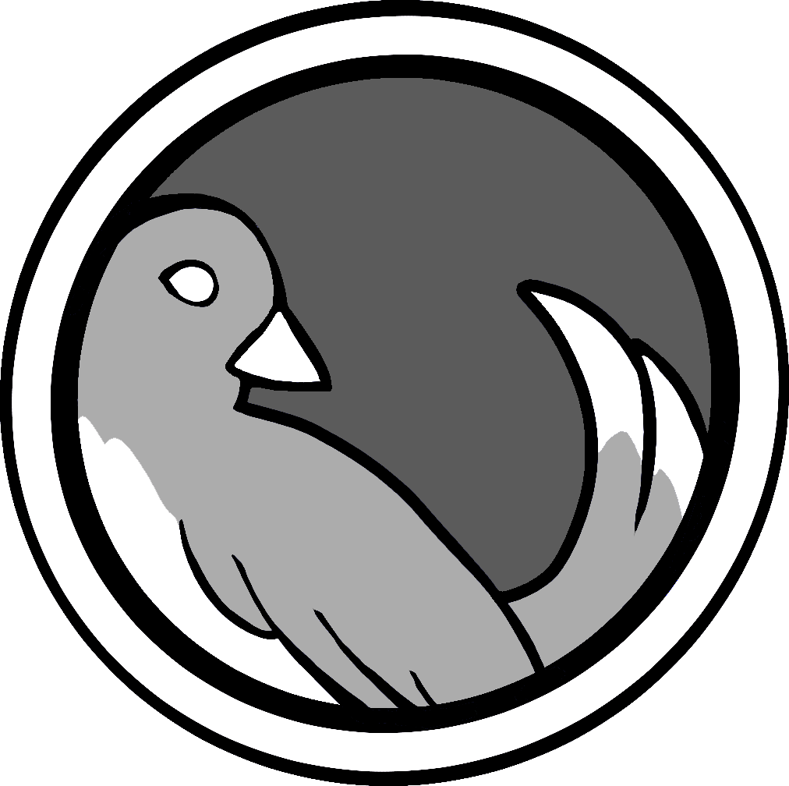
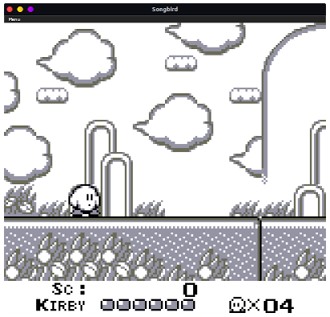
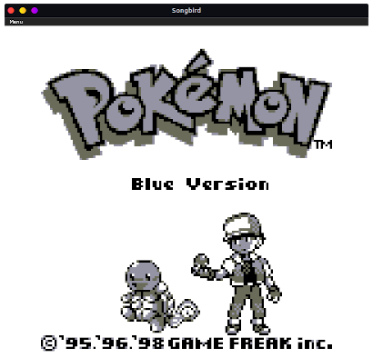
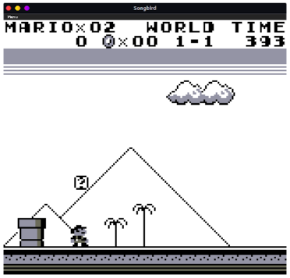
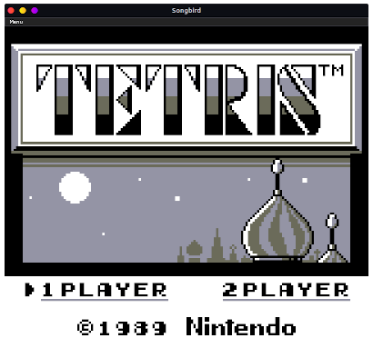
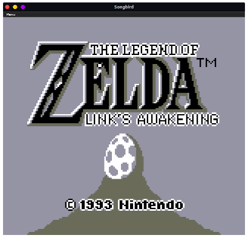
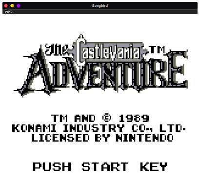

sonGBird
========

Songbird is a cross-platform Nintendo Game Boy emulator written in Rust. It runs on Windows, MacOS, Linux, Raspberry Pi, and in a web browser via WebAssembly.

Written by aquova, 2019-2021

https://github.com/aquova/songbird

https://aquova.net/songbird

## Downloads

Latest builds can be downloaded [here](https://cirrus-ci.com/github/aquova/songbird/master)

## Features
- [X] Original DMG Game Boy support
- [X] Game Boy Color support
- [X] Browser builds
- [] Audio
- [] Super Game Boy support

## Screenshots

## License

Songbird is licensed under the GNU General Public License v3.0
